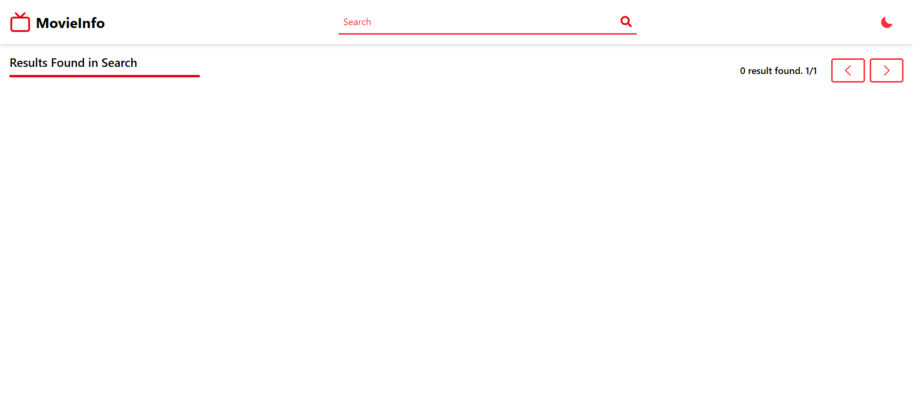
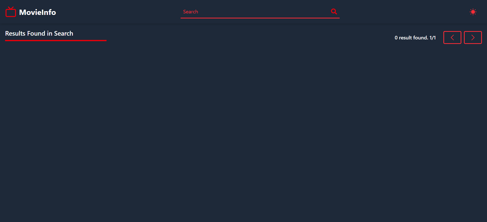
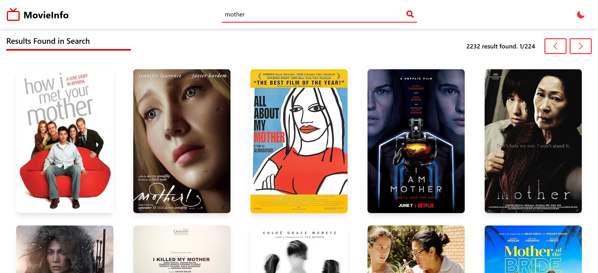
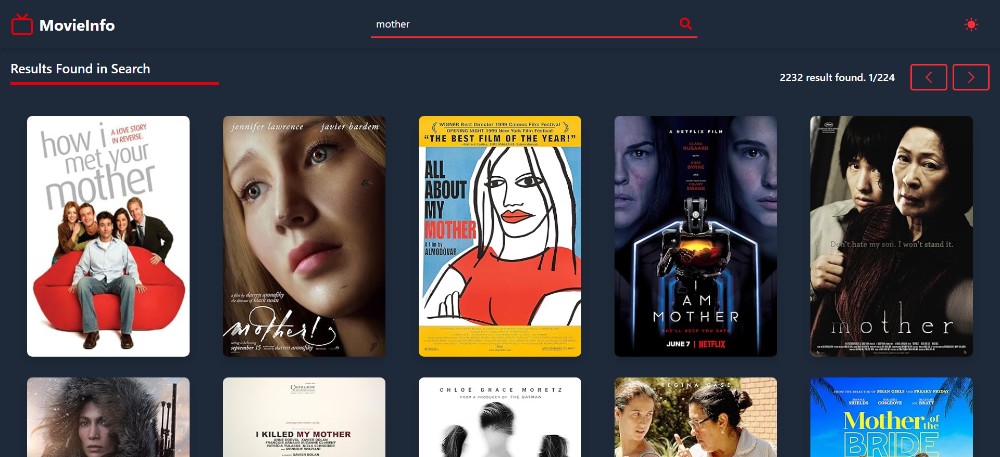
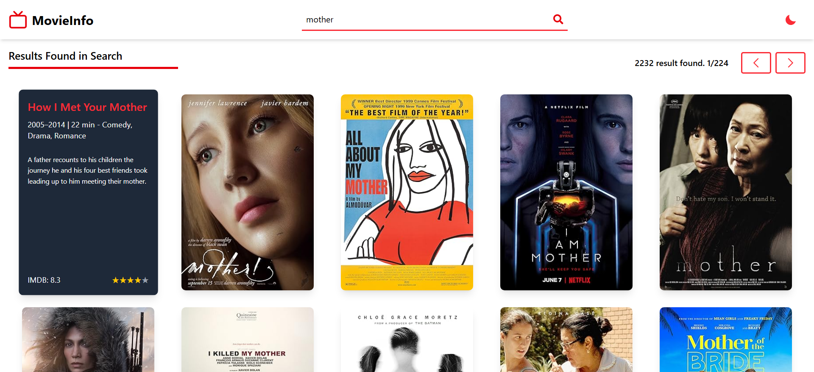
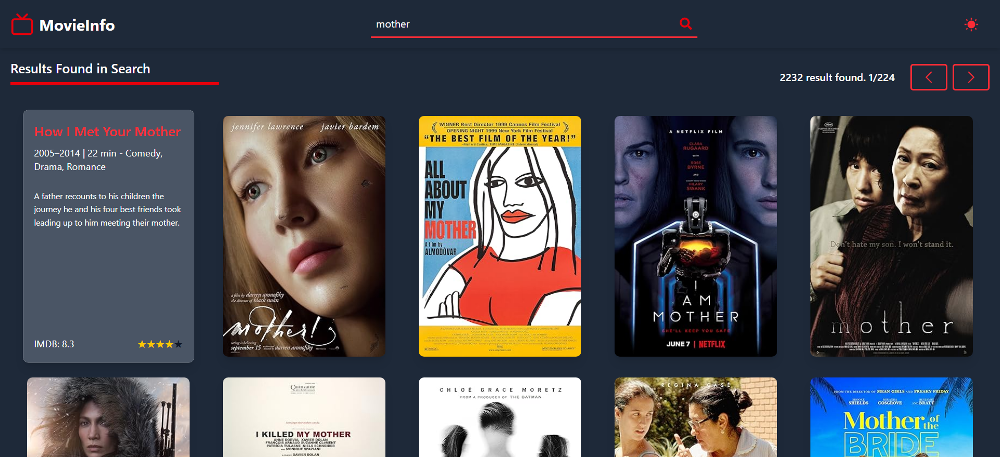
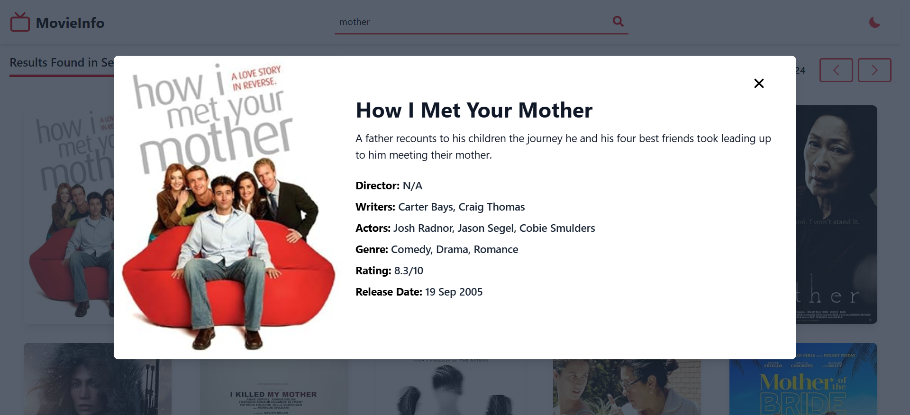
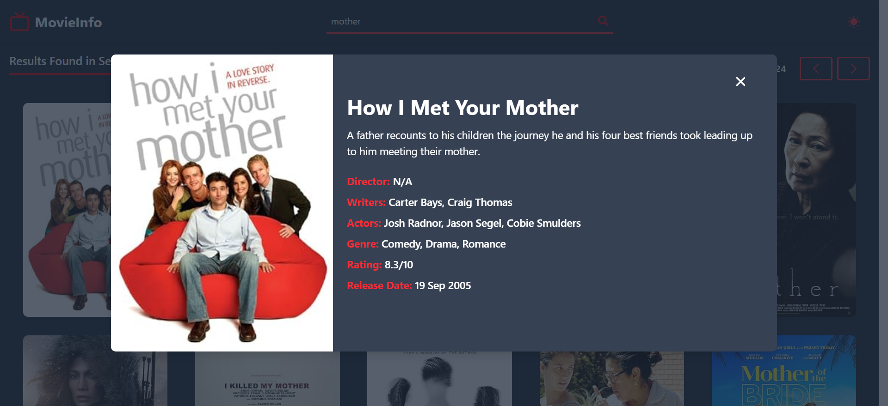
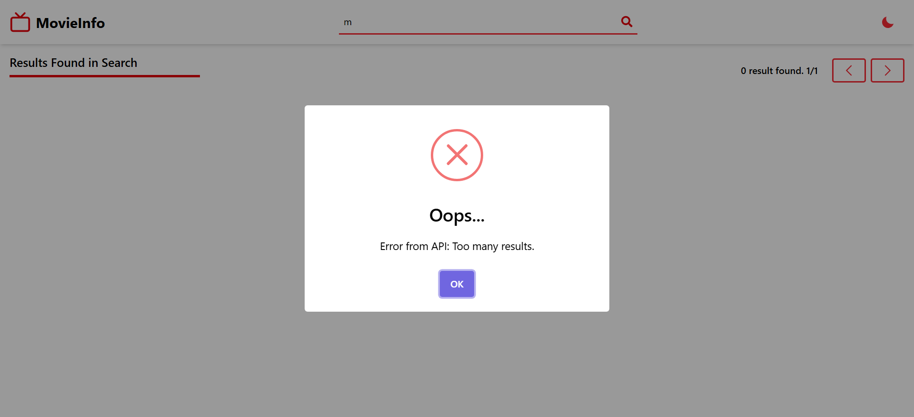
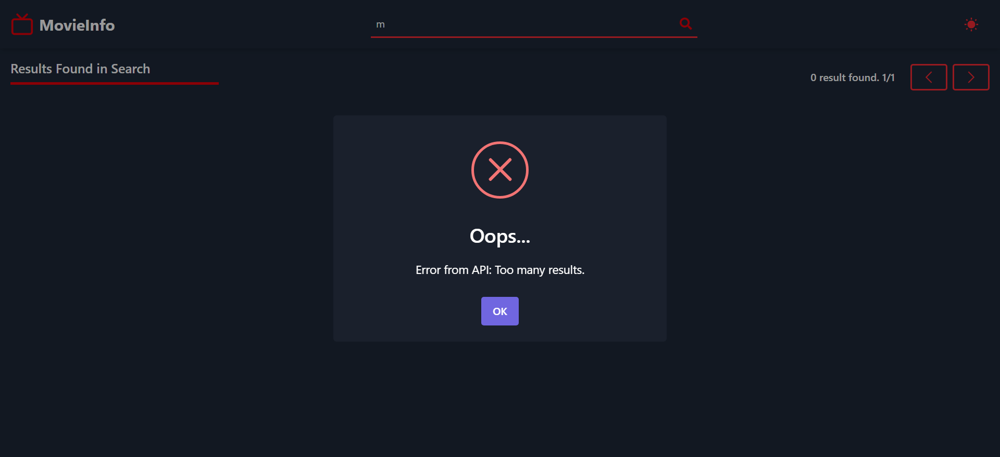

# 🎥 MovieInfo - React Film ve Dizi Arama Uygulaması

Bu proje, OMDb API ile film ve dizi araması yapabileceğiniz, şık ve kullanıcı dostu bir arayüz sunan bir React uygulamasıdır. Uygulamada, arama sonuçları kartlar halinde listelenir, posterlerin üzerine gelindiğinde temel bilgiler gösterilir ve başlığa tıklanarak detaylı bilgilere ulaşabileceğiniz modern bir modal açılır.

## ✨ Öne Çıkan Özellikler

- 🔍 **Film & Dizi Arama:** OMDb API üzerinden başlığa göre film/dizi araması yapılır.
- 🖼️ **Kart Görünümü:** Arama sonuçları posterlerle birlikte kart yapısında listelenir.
- 🧾 **Hover Bilgi:** Poster üzerine gelindiğinde film başlığı ve kısa bilgiler görünür.
- 🔍 **Detaylı Modal:** Film başlığına tıklanınca modal üzerinde tüm detaylar kullanıcıya sunulur.
- 📟 **Sayfalama:** API’den gelen veriler sayfalara bölünür (her sayfada 10 sonuç) ve kullanıcı sayfa değiştirebilir.
- ⚠️ **SweetAlert2 ile Bildirimler:** Boş arama, sonuç bulunamama gibi durumlarda kullanıcı dostu ve şık uyarılar.
- 🌗 **Dark Tema Desteği:** Göz yormayan bir karanlık tema ile modern kullanıcı deneyimi.
- 📱 **Responsive Tasarım:** Farklı ekran boyutlarına uyumlu tasarım (mobil, tablet ve masaüstü).

## 🛠️ Kullanılan Teknolojiler

- **React** – Component tabanlı modern frontend mimarisi
- **Tailwind CSS** – Hızlı, sade ve responsive tasarım için
- **SweetAlert2** – Bildirimler ve uyarı mesajları için kullanıcı dostu modal yapılar
- **OMDb API** – Açık film & dizi veritabanı
- **React Hooks (useState, useEffect)** – State ve lifecycle kontrolü
- **Custom Modal & Sayfalama Yapısı** – Kendi yazdığım mantıkla oluşturulmuş kullanıcı deneyimi çözümleri

## 📸 Ekran Görüntüleri












## 📦 Kurulum

Projeyi klonlayarak başlayabilirsiniz:

- **.env dosyası yoksa oluşturun ve kendi API anahtarınızı girin: VITE_API_KEY={YOUR_API_KEY}**
  
```bash
git clone https://github.com/furkan-karapinar/MovieInfo-React.git
cd MovieInfo-React
npm install
